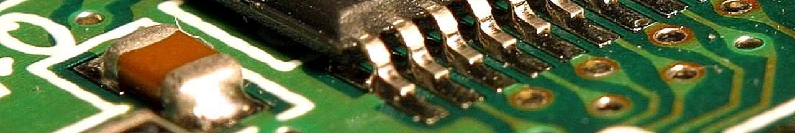

# Interactive Systems [Fundamentals] –  Winter 22/23

***Disclaimer:*** *This repo documents an Interaction Design course held at [KISD](https://kisd.de) in the winter term 2022/23. In the "sessions" section you can find supporting material to the four sessions for consolidation or rework in case of missed meetings. Please keep in mind that the transcript was not written for (scientific) completeness _and that reading without participation_ in the course is of limited value.*

## Intro

Welcome to the repository of the KISD Interactive Systems [Application] – Embedding AI Into Living Objects course. 

## Sessions

- 🖐 [**Session 1 – Intro**](/sessions/Session1_Intro/README.md)

## The Course

This course takes place in the winter semester of 2022/23 at the [Köln International School of Design](https://kisd.de) in Cologne, Germany. The description reads:

<b>View Course Description</b>

<i>
Code and algorithms are the materials from which essential aspects of our social, cultural and economic future are built. When designing these interactive systems and objects, a substantial understanding of the underlying technology (hardware) and the executed algorithm or program code (software) is essential. With the increase of such systems in everyday life, there is an increasing need to approach these topics in the context of design studies (especially in interaction/interface/product design) and to develop the ability to develop such prototypes.</i>

<i>
With the new "Living Objects Lab", AI (Artificial Intelligence) is now being integrated into teaching and research at KISD: there, tools, infrastructure, (research) space and supervision are available to embed "intelligent" systems in physical objects. In this way, these are transferred from the virtual "cloud" into "material" and made "alive" through meaningful human-machine interfaces. </i>

<i>

However, the information processing in previous AI systems was mostly outsourced to computationally powerful servers (in the "cloud"), while the object only functioned as an interface. Recently, information has also begun to be (pre)processed decentrally on the end device (e.g. a microcontroller). This process is called Edge AI/Computing, derived from the "edge" of the network / cloud. </i>

<i>

In this course, we first deal with the term "AI" in general, look at conceptual basics of Edge AI and talk about its pros and cons. We exemplarily enable objects to react to changes in their environment in an autonomous and hopefully intelligent way by integrating AI on the edge level. We will then close with an outlook on further AI research and development fields. </i>

<i>

Prerequisite for participation is the preceding "Interactive Systems [Fundamentals]" course or basic experience in programming (e.g. through an Arduino course in the Proto Lab). 
</i>

## Authors

This repo is maintained by [Jakob Kilian](https://github.com/jakobkilian)
