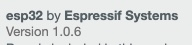

# Chapter 2 | Explore

***Disclaimer:*** *This page offers supporting material for an Interaction Design course held at [KISD](https://kisd.de) in the winter term 2022/23. Visit the [landing page](https://github.com/KISDinteractive/fundamentals22w) of this course for more information.*

# 2.1 Train Model in Predefined Setting

In chapter 2 we made some practical experiments with an ESP32-CAM board. These are the steps we went through, **which can only be reproduced with the physical board available and connected to the computer by cable:**

## Flash Code to ESP

1. Download and install the [Arduino IDE](https://www.arduino.cc/en/software)
2. Do to *Settings → "Additional boards manager URLs" →* enter: https://dl.espressif.com/dl/package_esp32_index.json
3. Go to *Tools → Board: → Boards Manager...* and search for "esp32". Install *esp32 by Espressif Systems* by clicking on "install" 
4. Download the prepared [code file](/src/ESP32-CAM_Teachable_Machine/ESP32-CAM_Teachable_Machine.ino). Faster way for beginners: click on "raw" → select all code & copy → open new Arduino file → paste code into it
5. Upload
6. Check Serial Manager (baud rate = 115200). There should be a "IP address is...", in case the board managed to connect to the WiFi
7. Make a note for the IP and call it with your browser. We will call it YOURIP from now on.
8. Click on "start stream" and check that you can see the live video stream from the ESP.

## Set up OBS

- Download and install [OBS](https://obsproject.com)
- In OBS: delete all sources, add a "browser source" and enter: http://YOURIP:81/stream (replace YOURIP with the actual IP)
- Position the stream by dragging and resizing.
- Click on "Activate virtual camera" on the bottom right

## Train Model via Teachable Machine

- Open a new image project on [Teachable Machine](https://teachablemachine.withgoogle.com/train/image)
- Select the virtual OBS webcam as Input
- Add data for the two (or more) classes and train the model (details have been discussed in the course)
  - Test if the model works with the test function of Teachable Machine (appears on the right hand side after training a model)

- Click on *export model → upload model → copy link*

## Run Inference

- Finally go to http://YOURIP again and paste the link you have just copied from Teachable Machine into the "load model" field and click on *start detection*

Now your browser (and the machine running the browser) will run the model using the image stream from the ESP, and the LED on the ESP will turn on when the first class of trained objects is detected. Note that in the moment you close the brwoser window, the ESP won't change the LED anymore, because the calculation has been done in your browser. This is a classic Edge AI fake that we can use e.g. to create *living object* prototypes...

