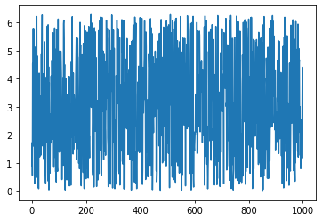
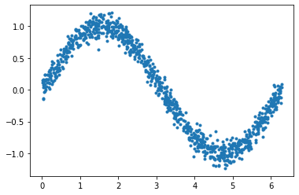
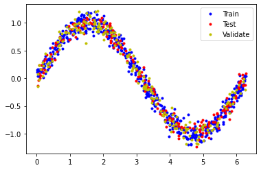
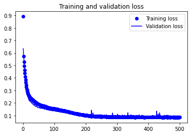
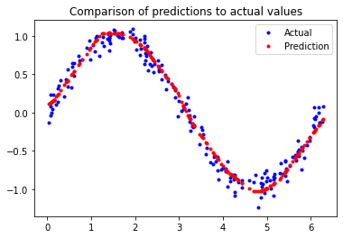
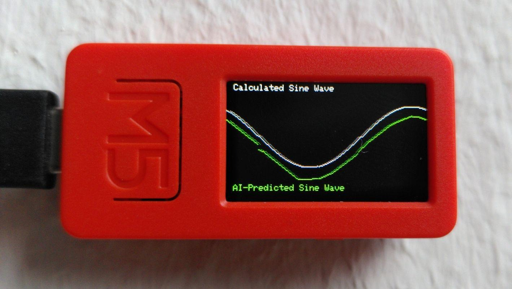

# Chapter 4 | Hello World

***Disclaimer:*** *This page offers supporting material for an Interaction Design course held at [KISD](https://kisd.de) in the winter term 2022/23. Visit the [landing page](https://github.com/KISDinteractive/fundamentals22w) of this course for more information.*

# 4 Training our first Model from Scratch

Chapter 4 spanned two actual meetings (12 & 19.12). First we set up a virtual machine on a server to run the training, then we went through the training process and the corresponding Python commands, and finally we loaded the code onto a M5StickC-Plus microcontroller.

**The content and code of this chapter are heavily inspired by a two-part video tutorial by Shawn Hymel** ([Jupyter Notebook file](https://gist.github.com/ShawnHymel/79237fe6aee5a3653c497d879f746c0c), [part 1](https://www.youtube.com/watch?v=BzzqYNYOcWc) & [part 2](https://www.youtube.com/watch?v=dU01M61RW8s)), which in turn is based on a notebook file (now available [here](https://github.com/tensorflow/tflite-micro/blob/main/tensorflow/lite/micro/examples/hello_world/create_sine_model.ipynb)) from arguably the [most important book in TinyML](https://www.oreilly.com/library/view/tinyml/9781492052036/) by [Pete Warden](https://github.com/petewarden).

The main difference between his tutorial and this chapter is the use of the "EloquentTinyML" Arduino library and the [M5StickC-Plus](https://shop.m5stack.com/products/m5stickc-plus-esp32-pico-mini-iot-development-kit) to run the model, while Shawn used the "Arduino Nano 33 BLE Sense" board which is currently not available.

## 4.1 Setting up Our "Hello World" Example (12.12)

We started by setting up the system in which we want to train a model that predicts a sine wave as a "Hello World" to test if our setup is working.
- To do this we boot a virtual kitegg server (you already got credentials) with the option **"(kisd-auto-kernels)"**
- Next, we want to get this git repository (repo for short) available locally on our virtual machine (on the server). So we type `git clone https://github.com/KISDinteractive/embedded_ai_22w.git` in a "terminal" window of the JupyterLabs instance and hit the enter key.
- After a few seconds, the repo should now appear in the file system preview on the left-hand side as a directory called "embedded_ai_w22".
- We then type `embedded_ai_22w/chapters/ch4-HelloWorld/src/init-jupyter-kitegg.sh` in the terminal and hit enter. This will install some dependencies we will need later. *We discussed the script in more detail in the meeting.*
- Finally, we navigate to the same folder (chapters/ch4-HelloWorld/src/) by using the mouse in the file manager on the left of JupyterLabs and double click the ipynb file (a Jupyter Notebook) to open it. 
- When prompted which kernel you want to use, select the kernel " ... py37". If you are not asked, click on the kernel name in the upper right corner and the kernel prompt will pop up.
- Now **run the first two cells** of the Jupyter Notebook (remember: press Shift + Enter to do so) and check that the Python and Tensorflow versions are as described in the comments.

## 4.2 Training the Model

To train the model you basically just have to run all the cells in the notebook one by one. There are some explanatory comments in the code, but during the session we went through the lines of code in more detail. 

*Note: apart from some verbal explanations, we didn't go deeper into how neural networks and deep learning work, we just jumped in. There will be some context in the next session!*)

In summary, the steps are:

### 1. Create Data to be Used as Training Data

1. Generate 1000 X-Values (1000 numbers between 0 and 2xPi)



2. Generate the corresponding Y-Values (calculate sine of every X-Value)



3. Split this data into 60% training (blue), 20% balidation (yellow) and 20% testing (red)



### 2. Prepare the Actual Model

Create a 2-layer model with 16 nodes in each layer using Keras and TensorFlow.

### 3. Train the Model

Using the Keras `model.fit` function with the following parameters

- batch_size: 20 (how many predictions to make before fitting the model)
- epochs: 500 (how often you use the whole dataset for training)

*We have briefly discussed the meaning of "layers", "nodes", "epochs" and "batches", but will go into more detail in the next session.*

### 4. Plot and Test Model

We then plotted the progress of the deep learning process and discussed it.



This shows (in very simple terms) how close the predictions of the model are to the actual calculated (and therefore correct/targeted) sine values. On the x-axis are the epochs and you can clearly see that there is a lot of progress in the beginning, a little between 10 and 250 epochs and no real progress after 250 epochs. We could probably train this data set with just 250 epochs. *More on this in the next session.*

Finally, we ran the model in Jupyter to see if it worked:



We expect the red dots to represent a sine wave (our target), while in blue we also show the corresponding (in our case 200) calculated values with the noise added. This is a small data set, so some variation is normal/expected. 
**This looks pretty good, so let's move on to the next step.** If the red line here is not ok, we would need to adjust the training parameters or create a larger data set...

### 5. Convert the Model to TensorFlow Lite & Make it a C Array

The last cells just convert our TensorFlow model into a .h file that can be read by the Arduino library and looks like this (just a snippet):

```c
unsigned char sine_model[] = {
 0x1c, 0x00, 0x00, 0x00, 0x54, 0x46, 0x4c, 0x33, 0x00, 0x00, 0x12, 0x00,
  0x1c, 0x00, 0x04, 0x00, 0x08, 0x00, 0x0c, 0x00, 0x10, 0x00, 0x14, 0x00,
  0x00, 0x00, 0x18, 0x00, 0x12, 0x00, 0x00, 0x00, 0x03, 0x00, 0x00, 0x00,
  0x58, 0x0a, 0x00, 0x00, 0x00, 0x06, 0x00, 0x00, 0xe8, 0x05, 0x00, 0x00,
  0x34, 0x00, 0x00, 0x00, 0x04, 0x00, 0x00, 0x00, 0x01, 0x00, 0x00, 0x00,
  0x04, 0x00, 0x00, 0x00, 0x50, 0xf6, 0xff, 0xff, 0x08, 0x00, 0x00, 0x00,
  0x0b, 0x00, 0x00, 0x00, 0x13, 0x00, 0x00, 0x00, 0x6d, 0x69, 0x6e, 0x5f,
  ...
```

## 4.3 Uploading the Arduino Sketch with our Freshly Trained Model

- We downloaded the newly created "sine_model.h" file from JupyteLabs and the [already prepared folder including the .ino file](chapters/ch4-HelloWorld/src/M5Stick-TF-SineWave) from this Github repo.
- We replaced the "sine_model.h" **in** the int folder with the freshly trained and downloaded "sine_model.h" file and opened the .ino sketch with Arduino. 
- In Arduino you need to install the **"EloquentTinyML by Simone Salerno"** and the **"M5StickC-Plus by M5Stack official"** libraries in the library manager. 
- And for the **M5StickC-Plus Board** that we were using, we added `https://m5stack.oss-cn-shenzhen.aliyuncs.com/resource/arduino/package_m5stack_index.json` to the "Additional Boards Manager URLs" in the Arduino Settings and then installed the **"M5Stack by M5Stack official"** boards in the boards manager.

With these steps we should be able to compile the sketch, upload it to the M5Stick connected via USB to the computer and see a calculated and a predicted wave on the display.



Again, you will find some comments in the Arduino file, we had some deeper analysis during the session.

### EloquentTinyML

A few words about the EloquentTinyML Arduino library we used:

This is the easiest way I have found to run TensorFlow models on ESP32 MCUs (and thus M5Sticks, for example). Alternatively, you can use the official ESP-IDF (Espressif IoT Development Framework) programming and flashing environment from "Espressif", the manufacturer of the chip. This can be done in any IDE (e.g. VSCode; documented in the official [instructions](https://docs.espressif.com/projects/esp-idf/en/latest/esp32/get-started/index.html#)) or using platform.io (a [handy tutorial](https://www.survivingwithandroid.com/run-tensorflow-lite-esp32-platformio/)). I consider both being much more complex and error-prone for beginners.

**The EloquentTinyML libary on the other hand has some major downsides:** 

- developed by a single maintainer; not very up to date
- only works with TensorFlow 2.1.1 and Python 3.7. This is the reason why we have to set up so many things on the virtual machine
- There is a bug on Windows Machines running Arduino 2.x.x that I couldn't solve so far (as of 19.12.22). **Using Arduino version 1.8.x however is a workaround.**

On the other hand, there are some simple examples on the project website and on Github that require much fewer lines of code and much less knowledge to flash on a MCU...

### Deprecated Official TensorFlowLite Library

There was an official Arduino library for using tflite models on Arduino, which was [removed from the official library manager two months ago](https://github.com/arduino/library-registry/pull/1748). You can still download and use the lib from [TensorFlow's Github](https://github.com/tensorflow/tflite-micro-arduino-examples#github), but it only supports **some boards, excluding ESP32 boards**. 

This is a real mess as many tutorials rely on this library and are now broken. Probably TinyML just isn't in vogue at the moment, while LLMs and Image Diffusion are all the rage. For now, it seems easiest to stick with the EloquentTinyML library and Arduino.
