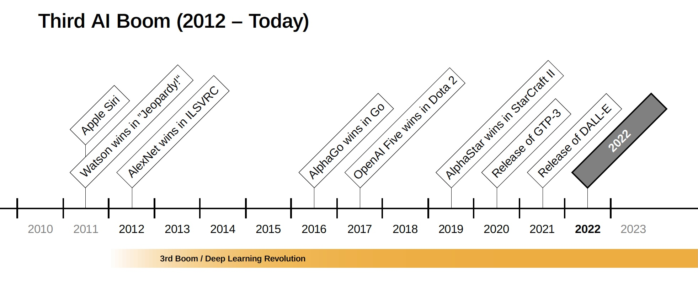

# Chapter 5 | Deep Learning

***Disclaimer:*** *This page offers supporting material for an Interaction Design course held at [KISD](https://kisd.de) in the winter term 2022/23. Visit the [landing page](https://github.com/KISDinteractive/fundamentals22w) of this course for more information.*

## 5.1 Context: the Third AI Boom

In the course we discussed the third AI Boom or – how some people call it – the "Deep Learning Revolution". Details of the most prominent events of this period will not be added to this repo soon, but may be added later in the form of the presentation slides.

##  5.2 Neural Networks & Deep Learning

We then discussed what "Deep Learning" respectively "Deep Neural Networks" actually means and went through the most important terms and hyperparameters  that are needed for the construction and training of neural networks. We did so by going through the steps of the sine wave Hello-World Jupyter Notebook example from chapter 4.

## 5.3 Optimisation through iterative experimentation

In order to grasp and understand the influence and interdependencies of the various hyperparameters, we have adapted the [Jupyter Notebook](src/HelloWorld-SineWave.ipynb) to produce reproducible results by using a predefined seed for Keras. Furthermore, we have improved the visual representation of the training process and the results.

