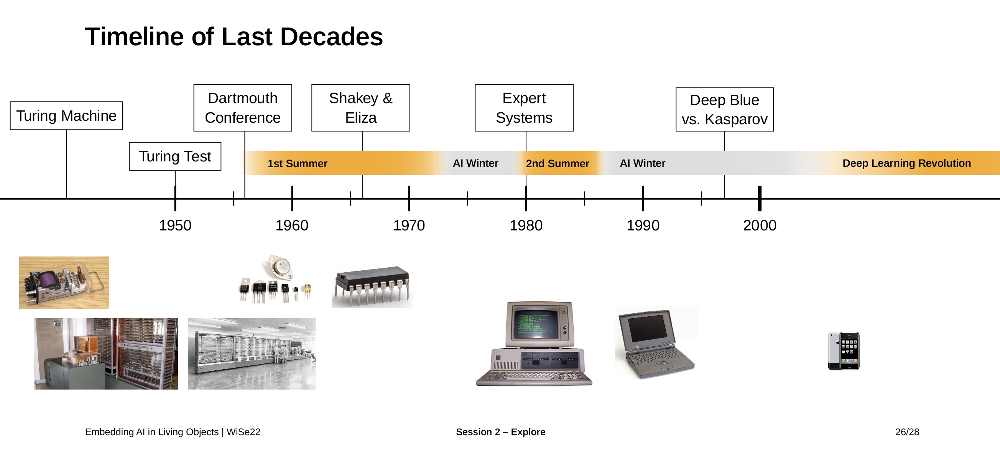
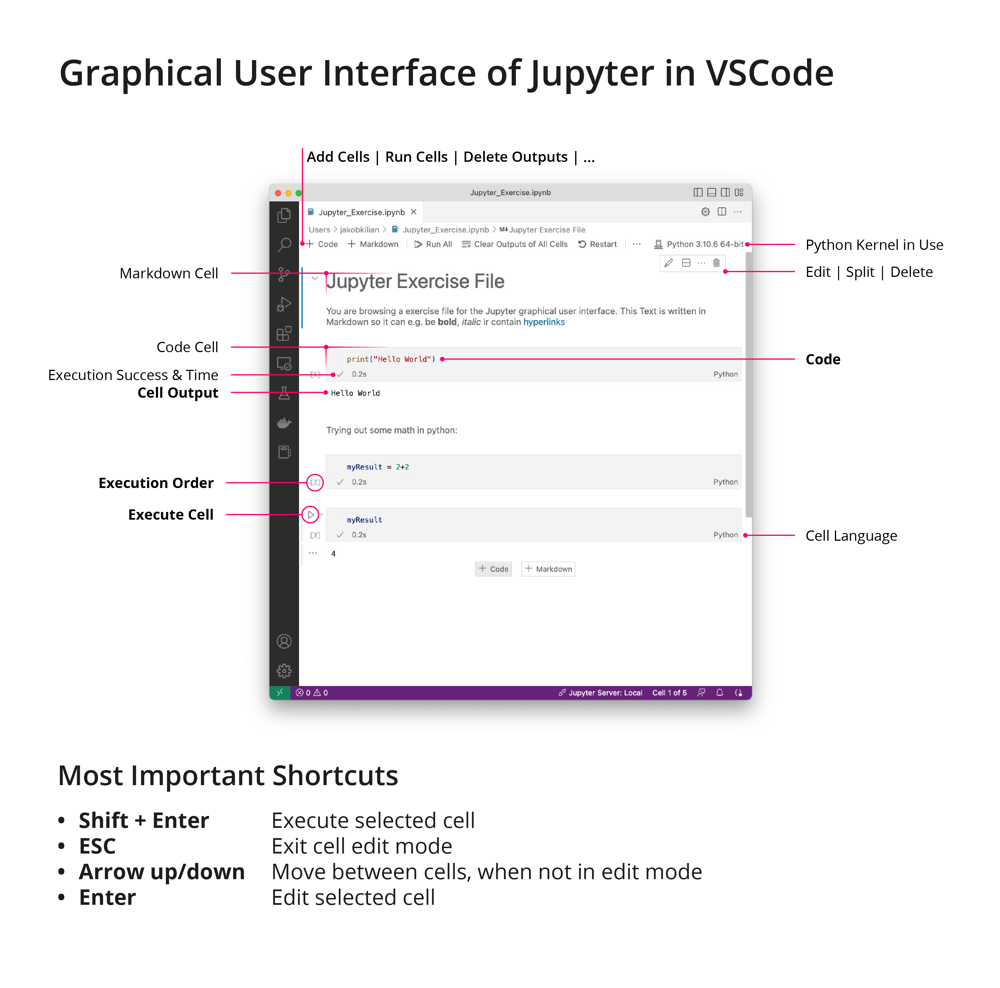

# Session 3 | 05.12.2022 – Background

***Disclaimer:*** *This page offers supporting material for an Interaction Design course held at [KISD](https://kisd.de) in the winter term 2022/23. Visit the [landing page](https://github.com/KISDinteractive/fundamentals22w) of this course for more information.*

# 3 Background

Having some historical background on AI helps understanding current state of the art and how and why certain fields have developed in the way they did.

# 3.1 A Short History of AI

The history of speculation about robots is long. Consider this quote by **Aristoteles in 300 B.C.:**

> “If every tool, when ordered, or even of its own accord, could do the work that befits it[…] then there would be no need either of apprentices for the master workers or of slaves for the lords.“

Industrial Revolution and Electricity pushed imagination even more. See the 3 laws of robotics by **Isaac Asimov in 1942**:

1. > A robot may not injure a human being or, through inaction, allow a human being to come to harm.

2. > A robot must obey orders given it by human beings except where such orders would conflict with the First Law.

3. > A robot must protect its own existence as long as such protection does not conflict with the First or Second Law.

We then discussed the most important events and phases in the history of AI from its emergence to the (still ongoing) so-called "Deep Learning Revolution", which has a completely new dynamic compared to the five decades before.

This is intended to give an overview of the subject and cannot reflect the entire picture of the development. Neither on a technical nor on a humanistic, societal level does this listing claim to be complete. The lower part of the timeline contains links to the previous course ["Interactive Systems [Fundamentals]"](https://github.com/KISDinteractive/fundamentals22w). Below details on the key points are given.

## Turing Machine

- Theoretical concept of the modern computer by the mathematician Alan Turing.
- Foundation of the research field of computer science. 
- Also see ["Interactive Systems [Fundamentals]"](https://github.com/KISDinteractive/fundamentals22w) for details.

## Turing Test

- paper in 1950 
- Alan Turing asked "can machines think?" 
- proposed a test to tell human beings and computers apart
- Back in time: intellectual exploration of the topic of AI before it was even called "AI". 
- Today: a much debated topic
  - some claim to have fulfilled the (loosely described) aspects of the test
  - others propose updated, better definitions and consider it not yet satisfied. 
- Also see ["Interactive Systems [Fundamentals]"](https://github.com/KISDinteractive/fundamentals22w) for details.

## Dartmouth Conference

- in 1956: Dartmouth Conference (Dartmouth Summer Research Project on Artificial Intelligence)
- Leading Computer Scientists, Mathematicians and Linguists met to conduct a **8 week research project** on **solving tasks with computers**.
- Founded term: **Artificial Intelligence**
- Later they said, they were not happy with the term, but needed a name to distinguish "AI" from the concept of cybernetics...
- "The study is to proceed on the basis of the conjecture that every aspect of learning or any other feature of intelligence can in principle be so precisely described that a machine can be made to simulate it."
- **A lot of big Words, terms got defined, goals got set, "AI" was founded as research discipline.**
- (Of Course) **no big breakthroughs**

→ beginning of the 1st Summer

## 1st Summer

- Dreams of the "General Problem Solver" → throw in difficult, wicked problems in; get a solution out

- Even General Purpose Robots have been discussed
- Many different methods of AI at the same time
  - Predominant was the **Symbolic** AI paradigm: just enter all the logics and conditions needed to solve problem
  - Only some research on **Subsymbolic AI** (non-human-readable). Inspired by the brain; build out of neurons that make up an abstract network.
- Some stated: human intelligence in 3-8 years
- Big expectations, but mid 1960s nothing of the promised was there.
- **Funding was cancelled. AI Winter began**

### Shakey

See [video of "Shakey"](https://youtu.be/GmU7SimFkpU?t=105),  a mobile all-purpose robot that interacts (partially) autonomously with its environment.

### Eliza

See [video of "Eliza"](https://youtu.be/GmU7SimFkpU?t=105), a chatbot that was able to use natural language to communicate with human beings.

## 2nd Summer

- Again: **huge interests, funding, hype**

- This time solving **practical matters** was in the foreground

- main topic: **domain-specific expert systems** (see below)

- **But:** systems were to expensive; difficult to keep updated; no trust in the systems (e.g. by doctors)

- Failed again → **2nd AI Winter** began

- Difference to 1st Summer: 1st mainly was about research, second about business

### Expert Systems

- knowledge of experts fed into databases
- enter input -> get answer to complex topics
- e.g. treatments in medicine, chatbots for travel booking

## Deep Blue vs. Kasparov

For quite a long time it got quiet around the AI scene. In 1997 the big shock: a computer program wins a chess game against the world champion Garry Kasparov. A game that has been seen as a thing that computers can't do/win due to their lack of creativity.

See [raw footage of Kasparov](https://www.youtube.com/watch?v=aNpv3LfCUa4) obviously having difficulty to believe that he just loses against an AI system.

# 3.2 Install Dependencies

We then installed a few components and apps that we will work with over the following sessions:

- **Python**: download from https://www.python.org/downloads/ (for windows choose the “installer”) and run the installer. **Note:** make sure the checkbox with "Add Python X.X to PATH" at the beginning of the installer is checked! If you missed that step and the check if python is installed (next section) fails, see ma post in spaces.
- **Arduino**: Download and run installer: https://www.arduino.cc/en/software 
- **Visual Studio Code** (not Visual Studio!): Download from [https://code.visualstudio.com](https://code.visualstudio.com/) and run installer
  (OR VSCodium from [https://vscodium.com](https://vscodium.com/) which is 100% Open Source and should work just as good)
  - install Extensions in VS Code :
    - Name: **Python**
      Id: ms-python.python
      Publisher: Microsoft
      [VS Marketplace Link](https://marketplace.visualstudio.com/items?itemName=ms-python.python)
    - Name: **Jupyter**
      Id: ms-toolsai.jupyter
      Publisher: Microsoft
      [VS Marketplace Link](https://marketplace.visualstudio.com/items?itemName=ms-toolsai.jupyter)

## Check if Python is installed locally

- Open a command-line interface.
  - **Mac:** open App "Terminal"
  - **Win:** open App "CMD", sometimes called "Command Line Prompt"
- Type `python --version` in the command line and hit the "Enter" key. 
- In case you see `Python` and some Version number like `3.11.0` you know now tht python was successfully installed.

## Access to Jupyter on the Server Cluster

For the time of the course the participants also got access (user name and password) to the server cluster of the research project on jupyter.kitegg.de.

For learning Jupyter and doing some basic stuff we can chose the "No GPU" option at the startup which saves a lot of energy!

## 3.3 Recap Python in Jupyter (in VSCode)

We then got to know the Jupyter user interface step by step. This is a overview of the most important elements and shortcuts:

We then went through the basics of the programming language python by using a Jupyter. [Here you can find a Jupyter Notebook](src/Jupyter_Basics.ipynb) containing all the steps with detailed comments and explanations.
